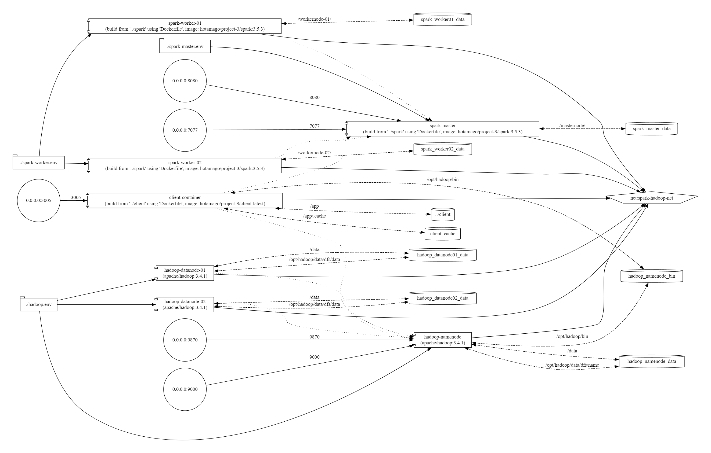
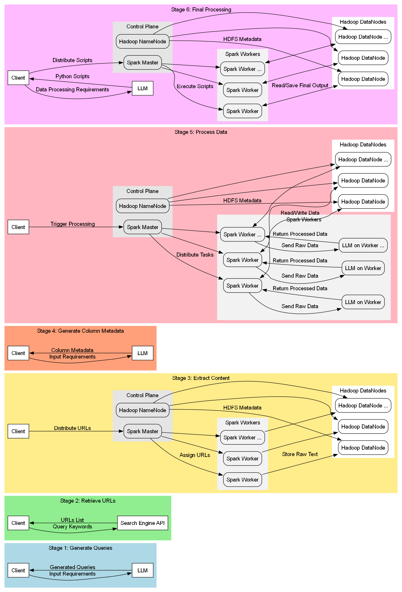

# <span style="color:#2e6c80">LLM and BigData in Process NL Data from Internet</span>

 

## <span style="color:#2e6c80">Table of Contents</span>

1. [Installation](#installation)
2. [Architecture](#architecture)
3. [Project Information](#project-information)
4. [Active Stage Projects](#active-stage-projects)
5. [Authors](#authors)

## Installation
1. Clone the repository:
   ```bash
   git clone https://github.com/hotamago/LLM-and-BigData-in-Distributed-NL-data-process.git
   ```
2. Navigate to the project directory:
   ```bash
   cd LLM-and-BigData-in-Distributed-NL-data-process
   ```
3. Run the Docker setup script (Must have docker to run):
   ```bash
   cd docker
   ./run.cmd
   ```
4. Access the application at `http://localhost:3005`.

## Architecture


## <span style="color:#2e6c80">Project Information</span>
Big Data and LLM Integration for processing Natural Language Data sourced from the internet. This project utilizes distributed storage and processing frameworks like Hadoop and Spark, orchestrated through Docker Compose, to efficiently manage and analyze large-scale datasets using Language Learning Models.

## Active Stage Projects
### Stage 1: Generate Queries
Generating search queries using an LLM for querying search engine APIs.

### Stage 2: Get URLs
Retrieving URLs based on the generated queries through search engine APIs.

### Stage 3: Get Content
Fetching content from the retrieved URLs using multiple Spark nodes and storing the data in Hadoop.

### Stage 4: Generate Columns Info
Creating column information to unify data processing across multiple nodes.

### Stage 5: Process Data
Processing the collected data to obtain final datasets for analysis using Spark and Hadoop across multiple nodes.

### Stage 6: Final Processing
Executing Python scripts generated by the LLM to process data and derive analysis results using Spark and Hadoop with multiple nodes.

## Workflow graph


## Authors
- **Nguyễn Hoàng Sơn**  
  Email: [nhson.ceo@hotavn.com](mailto:nhson.ceo@hotavn.com)  
  [Facebook](https://www.facebook.com/HotaVN/) | [LinkedIn](https://www.linkedin.com/in/hotamago/)
